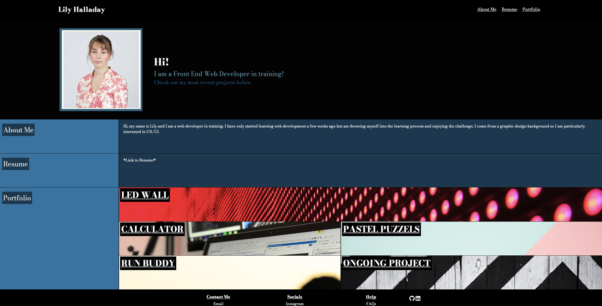

# Creating a Portfolio

## Description

The motivtion for this project was to create a basic portfolio which I can add to as the course progresses, using everything we've learnt so far in CSS and HTML. 

## Installation

N/A

## Usage

Link to deployed application: 
https://lily1595.github.io/Create-Portfolio-Challenge-/ 

Please click on the tabs at the top to navigate to the relevant pages on the site. 

## Credits

N/A

## License

Please refer to the license in the repo. 
---

